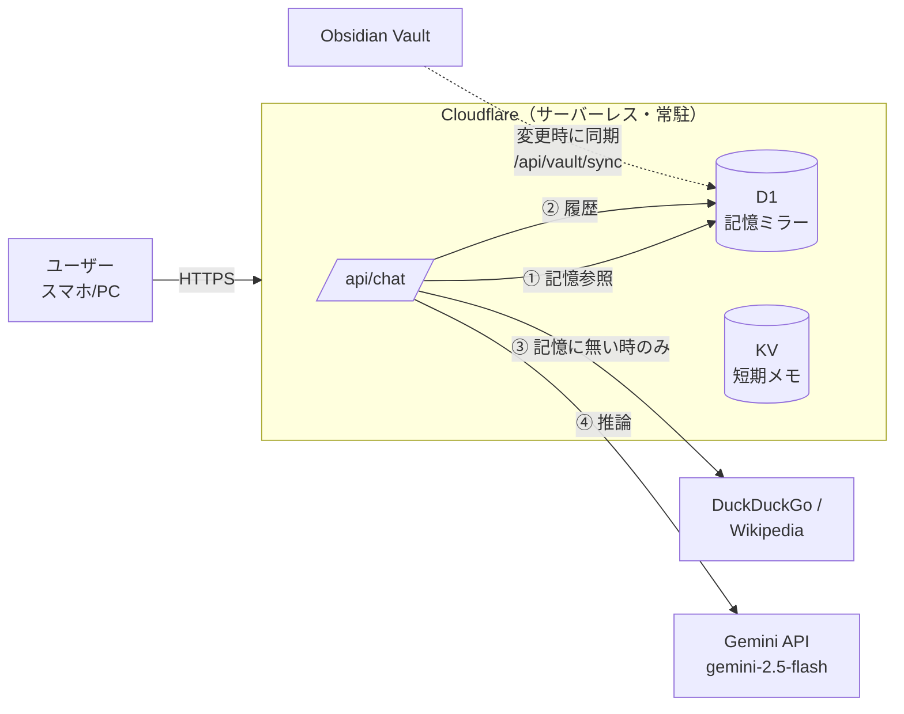

# Personal AI Assistant — "記憶を持つAI"

> A cloud-native, voice-capable personal AI assistant that **doesn't search your notes — it remembers them.**

対話型（チャット）UI を持つ、**個人専属の AI アシスタント**。
自分の Obsidian ナレッジを「外部データベースを検索した結果」としてではなく、
**AI 自身の記憶**として自然に語ることを設計思想の中心に置いています。

> 「Obsidian には〜と書かれています」(NG) ではなく
> 「私はこう認識しています」(OK)

このリポジトリは、私が個人運用しているアシスタントの **アーキテクチャと実装の仕組みを再現できる形で公開したポートフォリオ**です（実データ・本番資格情報は含みません）。

---

## ✨ 設計上のこだわり

| | |
|---|---|
| 🧠 **記憶を持つAI** | RAG の検索結果を生のまま返さず、人格(PERSONA)と文脈を踏まえ「自分の記憶」として再構成して応答 |
| ☁️ **Mac起動に依存しない** | リクエスト経路に自宅マシンを含めない。`User → Cloudflare → 記憶参照 → 推論 → 回答` で完結。スマホだけ・自宅PCがオフでも動作 |
| 🇯🇵 **日本語RAG** | 漢字2-gram・カタカナ・ASCII・ひらがな3文字以上を抽出し、カナ→英語シノニム（クロード→claude）で表記揺れを吸収。パス/タイトル一致を本文の×3で重み付け |
| 🔎 **記憶優先・検索は補完** | 記憶に無い知識質問のときだけ DuckDuckGo → Wikipedia で調べ、要約して回答 |
| 💬 **短期記憶** | 直近の会話履歴を保持し、文脈のある対話を実現 |

---

## 🏗 アーキテクチャ



**ポイント:** Obsidian → D1 へのミラー同期はノート更新時にだけ走り、
**読み取り・回答はすべてクラウドで完結**する。これにより自宅マシンの起動状態に依存しない。

### 回答生成フロー
```
会話履歴ロード → 記憶参照(D1) → [記憶に無ければ] Web検索 → Gemini推論 → 回答 → 履歴保存
```

---

## 🛠 技術スタック

| レイヤ | 技術 |
|---|---|
| フロント | Vanilla JS / Web Speech API（音声入出力）/ PWA |
| 実行基盤 | Cloudflare Pages Functions（サーバーレス Workers） |
| 記憶ストア | Cloudflare D1（SQLite + FTS5 全文検索）/ KV |
| 生成LLM | Google Gemini API（`gemini-2.5-flash`） |
| 外部検索 | DuckDuckGo Instant Answer API / Wikipedia API |
| 認証 | 簡易パスワード（ヘッダ照合） |

---

## 📂 主要ファイル

| パス | 役割 |
|---|---|
| [`functions/api/chat.js`](functions/api/chat.js) | 中核。記憶参照・Web補完・Gemini推論・会話履歴・人格制御 |
| [`functions/api/vault/sync.js`](functions/api/vault/sync.js) | Obsidian → D1 ミラー同期（トークン認証・冪等） |
| [`functions/api/memory.js`](functions/api/memory.js) | 「覚えて」コマンドの記憶ストア |
| [`schema.sql`](schema.sql) | D1 スキーマ（`vault_chunks` / FTS5 / `memories` / `conversations`） |
| [`public/index.html`](public/index.html) | チャットUI（デモ） |

---

## 🚀 ローカルでの再現手順

```bash
# 1. 依存関係
npm i -g wrangler

# 2. 設定（実IDに置き換え）
cp wrangler.toml.example wrangler.toml

# 3. D1 作成 & スキーマ適用
wrangler d1 create my-vault
wrangler d1 execute my-vault --file=schema.sql

# 4. シークレット登録
wrangler pages secret put GEMINI_API_KEY    # Google AI Studio で発行
wrangler pages secret put AINAS3_PASSWORD    # ログイン用パスワード
wrangler pages secret put CF_SYNC_TOKEN      # Obsidian同期トークン

# 5. デプロイ
wrangler pages deploy public --project-name=my-assistant
```

---

## 📚 ドキュメント

| ドキュメント | 内容 |
|---|---|
| [docs/REPRODUCTION_GUIDE.md](docs/REPRODUCTION_GUIDE.md) | **再現指南書** — 初心者がAIに読ませてゼロから作るための手順＋コピペ用プロンプト |
| [docs/USAGE.md](docs/USAGE.md) | **使い方ガイド** — ログイン・会話・PWA化などエンドユーザー向け操作 |
| [docs/TROUBLESHOOTING.md](docs/TROUBLESHOOTING.md) | **トラブル対策まとめ** — 開発中に実際にハマった所と解決策の知見集 |

## 🗺 ロードマップ

- [x] クラウド完結バックエンド（記憶参照・推論・会話履歴・Web補完）
- [x] 記憶の見せ方（自分の記憶として話す PERSONA 制御）
- [ ] 音声会話モード / Markdown 表示の強化
- [ ] Vectorize による意味検索（現状はキーワード検索）
- [ ] 人格切替 / エージェント / タスク管理

---

## 📄 ライセンス
MIT License © mikta — 詳細は [LICENSE](LICENSE)。

*本リポジトリは仕組みの公開を目的とし、個人の記憶データ・本番の資格情報は含みません。*
